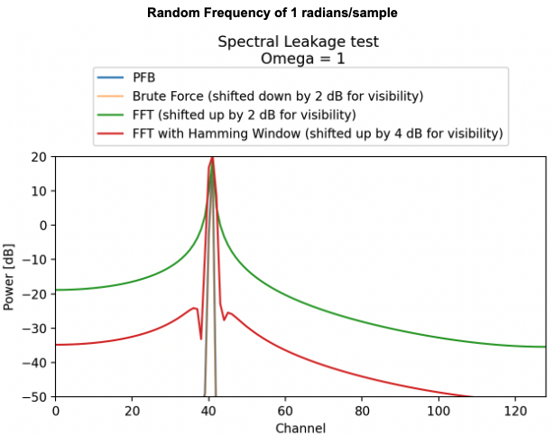
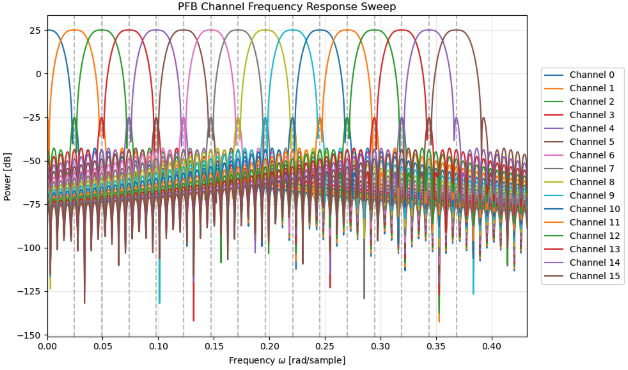
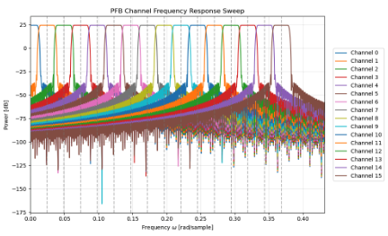

# Polyphase Filter Bank (PFB) Python Implementation

!!!IMPORTANT: This repository has undergone MAJOR changes and is now a submodule of the parent repository https://github.com/hilays79/PFB_CPU. Please follow the instructions there for proper usage.
This repository provides a Python implementation of a Polyphase Filter Bank (PFB) for digital signal processing, optimized for high-performance channelization.

## Directory Structure
- `PFB.py`: Core implementation of the Polyphase Filter Bank.
- `test_cases.py`: Script containing standard test routines.
- `test_signals.py`: Utility functions to generate input signals.
- `images/`: Contains visualization plots for leakage and response tests.

## Performance & Results

### 1. Spectral Leakage
The PFB significantly reduces spectral leakage compared to standard FFT channelisers, especially for non-integer cycle frequencies.



### 2. Channel Response (Taps Comparison)
Increasing the number of taps improves the flatness of the channel response and reduces scalloping loss.

| 4 Taps Response | 16 Taps Response |
| :---: | :---: |
|  |  |

* **4 Taps:** Visible scalloping losses at the channel edges.
* **16 Taps:** Near-perfect "brick-wall" response with minimal loss.

## Usage
Clone the repository and run the test suite:
```bash
git clone [https://github.com/hilays79/PolyphaseFilterbank_Python](https://github.com/hilays79/PolyphaseFilterbank_Python)
cd PolyphaseFilterbank_Python
python test_cases.py
